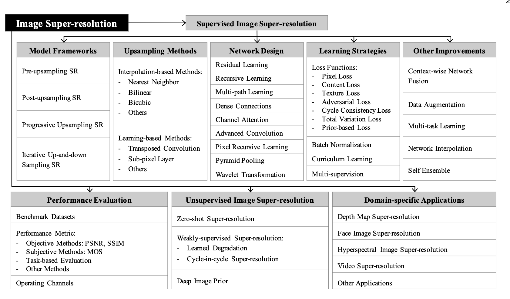
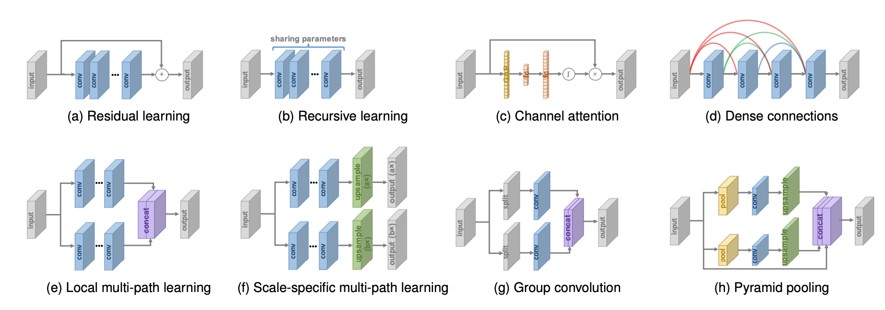
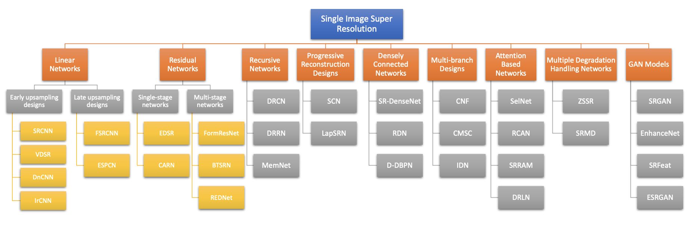
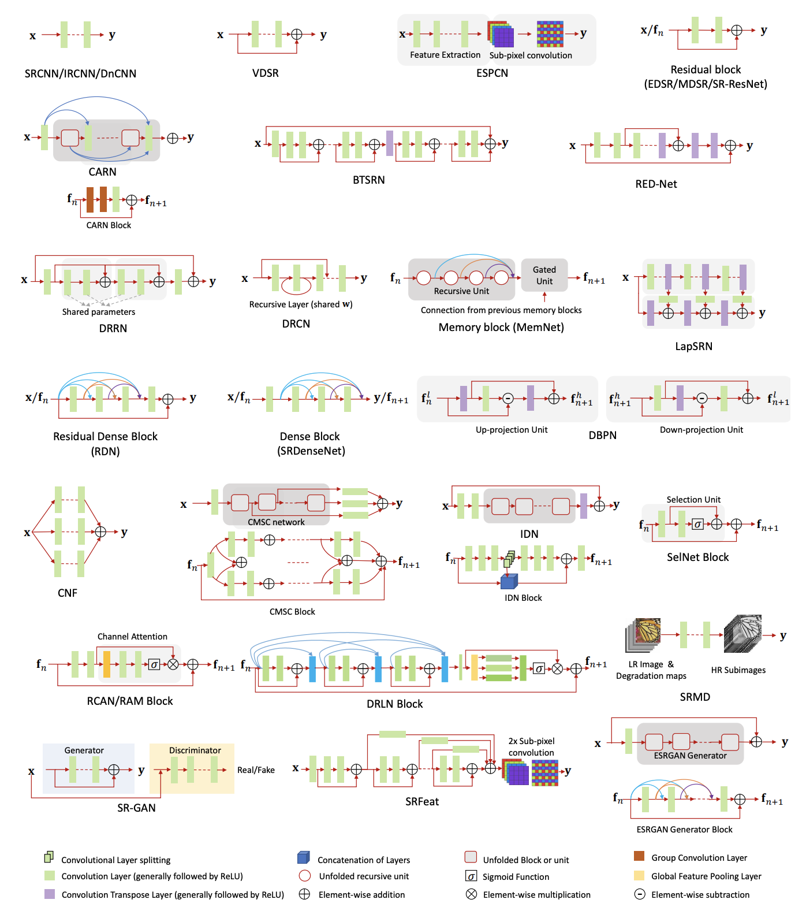

# Image-Super-Resolution-Guide

Image super-resolution is a hot topic in the computer vision field.

Recently, deep learning has been proven to be of great benefit to image super-resolution (SR) and video super-resolution (VSR).  After SRCNN, CNN-based SR methods are blooming and constantly refreshing the best results.

This project aims to collect papers, data sets, and techniques related to SR. Furthermore,  we will provide model explanation and analysis of advantages and disadvantages. 

All papers can be found in the【Paper】folder.

Some of the information in this project is referenced to [Awesome-Super-Resolution](https://github.com/ChaofWang/Awesome-Super-Resolution) and [Awesome Super-Resolution](https://github.com/ptkin/Awesome-Super-Resolution).

---

## The most widely used metric methods

| Metric  | Papers                                                       |
| :-----: | :----------------------------------------------------------- |
|  PSNR   |                                                              |
|  SSIM   | **Image Quality Assessment: From Error Visibility to Structural Similarity**, *Wang, Zhou; Bovik, Alan C.; Sheikh, Hamid R.; Simoncelli, Eero P*, **TIP 2004**, [[TIP](https://ieeexplore.ieee.org/document/1284395)]. |
| MS-SSIM | **Multiscale structural similarity for image quality assessment**, *Wang, Zhou; Simoncelli, Eero P.; Bovik, Alan C.*, **ACSSC 2003**, [[ACSSC](https://ieeexplore.ieee.org/document/1292216)]. |
|   IFC   | **An information fidelity criterion for image quality assessment using natural scene statistics**, *Sheikh, Hamid Rahim; Bovik, Alan Conrad; de Veciana, Gustavo de Veciana*, **TIP 2005**, [[TIP](https://ieeexplore.ieee.org/document/1532311/)]. |
|   VIF   | **Image information and visual quality**, *Sheikh, Hamid Rahim; Bovik, Alan C.*, **TIP 2006**, [[TIP](https://ieeexplore.ieee.org/document/1576816)]. |

---

## The most widely used training datasets

|     Name     |   Usage    |                                                             Link                                            |
| :----------: | :--------: | :---------------------------------------------------------------------------------------------------------: |
|    BSD300    |   Train    | [Download](https://www2.eecs.berkeley.edu/Research/Projects/CS/vision/grouping/segbench/BSDS300-images.tgz) |
|    BSD500    |   Train    | [Download](http://www.eecs.berkeley.edu/Research/Projects/CS/vision/grouping/BSR/BSR_bsds500.tgz)           |
|   91-Image   |   Train    | [Download](http://www.ifp.illinois.edu/~jyang29/codes/ScSR.rar)                                             |
|    DIV2K     |   Train    | [Website](https://data.vision.ee.ethz.ch/cvl/DIV2K/)                                                        |
|   Real SR    |   Train    | [Website](https://competitions.codalab.org/competitions/21439#participate)                                  |

---

## The most widely used test datasets

|     Name     |   Usage    |                                           Link                                      |
| :----------: | :--------: | :---------------------------------------------------------------------------------: |
|     Set5     |    Test    | [Download](https://uofi.box.com/shared/static/kfahv87nfe8ax910l85dksyl2q212voc.zip) |
|    Set14     |    Test    | [Download](https://uofi.box.com/shared/static/igsnfieh4lz68l926l8xbklwsnnk8we9.zip) |
|    BSD100    |    Test    | [Download](https://uofi.box.com/shared/static/qgctsplb8txrksm9to9x01zfa4m61ngq.zip) |
|   Urban100   |    Test    | [Download](https://uofi.box.com/shared/static/65upg43jjd0a4cwsiqgl6o6ixube6klm.zip) |
|   Manga109   |    Test    | [Website](http://www.manga109.org/ja/index.html)                                    |                                                        |
|   SunHay80   |    Test    | [Download](https://uofi.box.com/shared/static/rirohj4773jl7ef752r330rtqw23djt8.zip) |
|    DIV2K     |    Test    | [Website](https://data.vision.ee.ethz.ch/cvl/DIV2K/)                                |
|   Real SR    |    Test    | [Website](https://competitions.codalab.org/competitions/21439#participate)          |

---

## Single-Image Super-Resolution (SISR)
### 1. Non-deep learning based SR (classic papers)

1. 【BlindSR】**Nonparametric Blind Super-resolution**, *Michaeli, Tomer; Irani, Michal*, [[OpenAccess](http://openaccess.thecvf.com/content_iccv_2013/html/Michaeli_Nonparametric_Blind_Super-resolution_2013_ICCV_paper.html)], [[Project](http://www.wisdom.weizmann.ac.il/~vision/BlindSR.html)].

2. 【A+】**A+: Adjusted Anchored Neighborhood Regression for Fast Super-Resolution**, *Timofte, Radu; De Smet, Vincent; Van Gool, Luc*, [[ACCV](https://link.springer.com/chapter/10.1007/978-3-319-16817-3_8)], [[Project](http://www.vision.ee.ethz.ch/~timofter/ACCV2014_ID820_SUPPLEMENTARY/index.html)]

3. 【RFL】**Fast and accurate image upscaling with super-resolution forests**, *Schulter, Samuel; Leistner, Christian; Bischof, Horst*, [[OpenAccess](http://openaccess.thecvf.com/content_cvpr_2015/html/Schulter_Fast_and_Accurate_2015_CVPR_paper.html)]

4. 【SelfExSR】**Single image super-resolution from transformed self-exemplars**, *Huang, Jia-Bin; Singh, Abhishek; Ahuja, Narendra*, [[Matlab*](https://github.com/jbhuang0604/SelfExSR)], [[OpenAccess](http://openaccess.thecvf.com/content_cvpr_2015/html/Huang_Single_Image_Super-Resolution_2015_CVPR_paper.html)].

5. 【PSyCo】**PSyCo: Manifold Span Reduction for Super Resolution**, *Perez-Pellitero, Eduardo; Salvador, Jordi; Ruiz-Hidalgo, Javier; Rosenhahn, Bodo*, [[C++/Matlab*](https://bitbucket.org/EduPerez/psycosuperres/wiki/Home)], [[OpenAccess](http://openaccess.thecvf.com/content_cvpr_2016/html/Perez-Pellitero_PSyCo_Manifold_Span_CVPR_2016_paper.html)].

6. 【RAISR】**RAISR: Rapid and Accurate Image Super Resolution**, *Romano, Yaniv; Isidoro, John; Milanfar, Peyman*, [[arXiv](https://arxiv.org/abs/1606.01299)], [[TCI](https://ieeexplore.ieee.org/document/7744595)]

---

### 2. Deep learning based SR
#### 2.0. SR Survey

1. **Deep Learning for Image Super-resolution:A Survey**, *Zhihao Wang, Jian Chen, Steven C.H. Hoi*, [[arXiv](https://arxiv.org/pdf/1902.06068.pdf)]

2. **A Deep Journey into Super-resolution: A Survey**, *Saeed Anwar, Salman Khan, and Nick Barnes*, [[arXiv](https://arxiv.org/pdf/1904.07523.pdf)]

#### 2.1. Supervised SR

#### 2.2. Unsupervised SR

## Video Super-Resolution (VSR)
